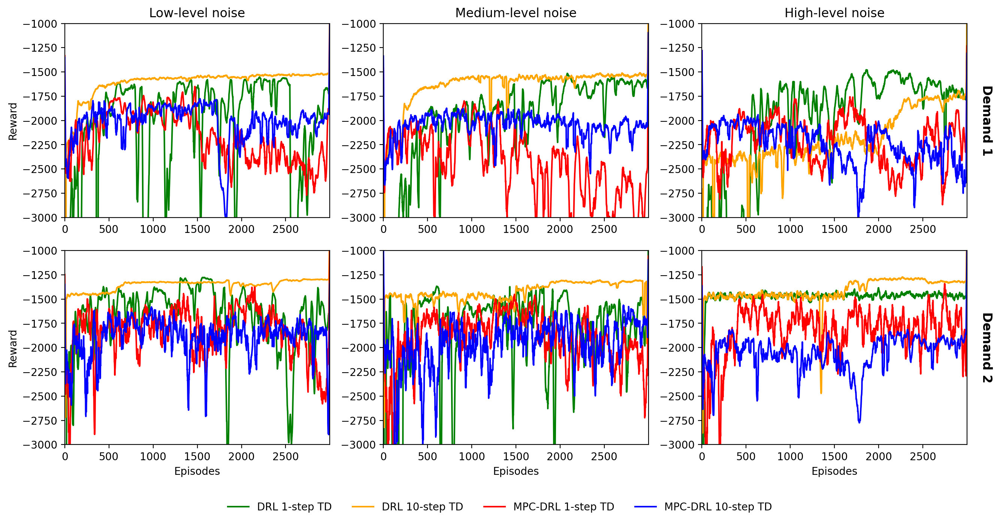

# Replication study of Combined MPC-DRL Framework for Traffic Control [Sun et al. 2024]

## Authors
Alessandro Bertelli [1,2,3], Kevin Riehl [3], Qiaosen Li [3], Anastasios Kouvelas [3], Michail A. Makridis [3]

**[1]** Politecnico di Milano, Milan, Italy.

**[2]** KTH Royal Institute of Technology, Stockholm, Sweden.

**[3]** ETH Zürich, Institute for Transport Planning and Systems, IVT Group, Zürich, Switzerland.

## Introduction
The original study proposed a Combined Model Predictive Control (MPC) and Deep Reinforcement Learning (DRL) framework for freeway traffic control using ramp metering. The algorithm aims to optimize traffic flow efficiency and minimize delays—tracking metrics like Total Travel Time (TTS), Total Waiting Time (TWT), and Queue Violations.

This replication reproduces the simulation framework, the discrete-time traffic flow model (METANET), and the hierarchical control logic described in the paper using Python. The objective is to evaluate the reproducibility of the reported results—including reproducing multi-start optimization steps, noise decay structures, and tabular results (such as Table V)—and to provide transparent, well-structured code for future benchmarking.

## The replicated study
```
Sun, D., Jamshidnejad, A., & De Schutter, B. (2024).
A Novel Framework Combining MPC and Deep Reinforcement Learning With Application to Freeway Traffic Control.
IEEE Transactions on Intelligent Transportation Systems, 25(7), 6756–6770.
DOI: 10.1109/TITS.2023.3342651
```

## What this repository includes
```text
./
├── 0_original_papers/                 # Reference papers
│   └── 2024_sun_et_al.pdf             # The replicated paper
│
├── 1_code_produce/                    # Core simulation and learning code
│   ├── main.py                        # Main experiment runner 
│   ├── train_mpc_drl.py               # Main training loop (Algorithm 1)
│   ├── train_drl.py                   # Script for standard DRL training
│   ├── generate_table_V.py            # Code to reproduce Table V
│   ├── generate_table_v_with_alinea.py# Table V with ALINEA and stat analysis
│   ├── config.py                      # Configurations and parameters
│   ├── controllers/                   # Control strategies
│   │   ├── alinea_controller.py       # ALINEA feedback controller baseline
│   │   ├── ddpg_controller.py         # DDPG agent logic
│   │   ├── ddpg_mpc_agent.py          # Hierarchical DDPG-MPC agent
│   │   ├── mpc_controller.py          # MPC baseline (SLSQP/IPOPT via CasADi)
│   │   ├── mpc_drl_controller.py      # Combined MPC-DRL framework
│   │   └── no_control.py              # No-control baseline
│   └── metanet/                       # METANET env and dynamics
│       ├── metanet_env.py
│       └── metanet_model.py
│
├── 1_data_source/                     # Input demand/simulation data
│   ├── demand_profiles.csv
│   └── correct_results/               # Validated reference CSV results
│
├── 2_data_produced/                   # Checkpoints and output results
│   ├── drl_models/                    # Saved DRL `.pt` checkpoints
│   ├── mpc_drl_models/                # Saved MPC-DRL `.pt` checkpoints
│   └── results/                       # Outcome logs (e.g., mpc_results.csv)
│
├── 3_code_visualization/              # Plotting scripts
│   └── plot_all_learning_curves.py 
│   └── plot_demand.py                 # Plot demand profiles
│
└── 3_data_visualization/              # Output figures (e.g., learning curves)
```

## Installation Instructions
1. Create and activate a Python ≥ 3.9 virtual environment.  
2. Install dependencies:
```bash
   pip install -r requirements.txt
```
3. Verify installation handles core logic by ensuring CasADi and Torch load properly:
```bash
python -c "import numpy, pandas, torch, casadi; print('OK')"
```

## Replication Notes
- The traffic dynamics correspond to the macroscopic **METANET** framework, with exact reproduction of the state space, action limits, and queue constraints as specified in Sun et al. (2024).

- The control structure implements:
  - **MPC Baseline**, optimized using CasADi's Multi-Start `sqpmethod` (originally IPOPT) performing 30 independent runs per execution step.
  - A standalone continuous **DRL (DDPG)** controller.
  - The hierarchical **MPC-DRL** architecture bridging proactive macroscopic optimization with responsive local continuous control.

- We thoroughly implement baseline evaluations, including **ALINEA** and a **No Control** scenario, reproducing learning curve convergence metrics against these baselines.

- **Table V verification**: We implement comprehensive numerical validation of all metrics (TTS, TWT, Minimal Speed, and maximal Queue Violations), repeating experiments across 10 distinct simulation runs to isolate statistical significance (Mean and Standard Deviations).

### Notes on our Computational Facilities:

Experiments were conducted on a Fujitsu workstation equipped with an Intel Core i7-6700 CPU (3.40 GHz) and 32 GB RAM. Full hierarchical MPC-DRL training iterations took several hours to complete on this setup.

### Notes on the available data: 

The simulation utilizes pre-defined synthetic or exact benchmark `demand_profiles.csv` found in `1_data_source/`. To ensure accurate reproduction of the original experimental results, these demands dictate varying traffic scenarios (e.g., High, Medium, Low congestion profiles).

## Run Instructions
1. Ensure the simulation demand scenarios are correctly referenced in `1_data_source/demand_profiles.csv`.

2. To train the hierarchical **Combined MPC-DRL Framework**, run the main loop from the parent directory:
    ```bash
    python 1_code_produce/train_mpc_drl.py
    ```

3. To run standard **DDPG** baseline training:
    ```bash
    python 1_code_produce/train_drl.py
    ```

4. To reproduce **Table V** (which executes all models against baselines, measures standard deviations with 10 independent seeds, and generates comprehensive statistics):
    ```bash
    python 1_code_produce/generate_table_v_with_alinea.py
    ```

5. Progress logs such as solver optimization times, episodic rewards, and validation TTS metrics will be outputted to the standard terminal, with raw metrics exported to the output folder.

## Output
Please note that checkpoint weights and final performance traces are systematically saved.

During training, the DDPG / MPC-DRL agent weights corresponding to the highest validation performance across episodes are saved automatically into their respective folders (`2_data_produced/drl_models/` and `2_data_produced/mpc_drl_models/`). The file naming conventionally indicates the demand profile evaluated:
- `Demand {IDX}_{TYPE}_best.pt`

Output testing CSVs capturing comprehensive quantitative evaluations (TTS, TWT, Queue Violation, Speed) over multiple independent simulation runs are available in `2_data_produced/results/`:
- `mpc_results.csv` — Standard MPC baseline controller outcomes
- `drl_10step_results.csv` — DDPG metrics
- `mpc_drl_1step_results.csv` — The hierarchical MPC-DRL architecture outputs
- `no_control_results.csv` / `hf_mpc_results.csv` — Validation statistics

Visual outputs illustrating learning curve stabilization and demand profiles are built with the code in `3_code_visualization/`.

## Training Curves

The following figure shows the episode reward progression during training for the DRL and MPC-DRL agents across all demand scenarios:



## Citation
Replication Study:
```
Bertelli, A., Riehl, K. (2026). 
[RE] A Novel Framework Combining MPC and Deep Reinforcement Learning With Application to Freeway Traffic Control. ReScience C, 202X(X).
DOI: [To be added upon publication]
```

Original Paper:
```
Sun, D., Jamshidnejad, A., & De Schutter, B. (2024). 
A Novel Framework Combining MPC and Deep Reinforcement Learning With Application to Freeway Traffic Control. 
IEEE Transactions on Intelligent Transportation Systems, 25(7), 6756-6770.
DOI: 10.1109/TITS.2024.3379970
```
